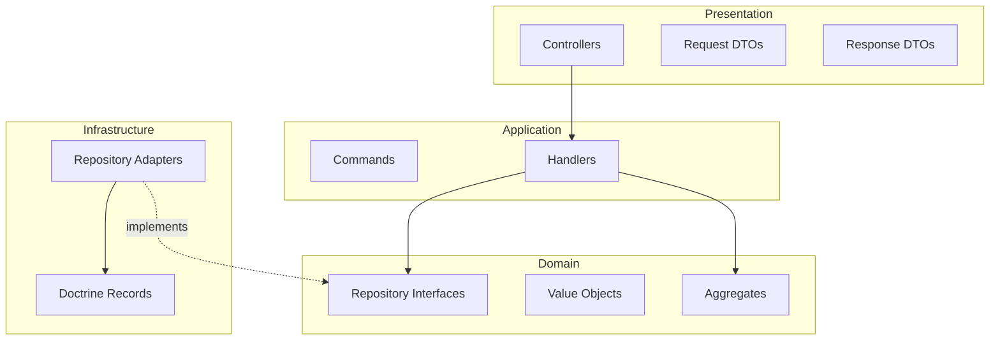

# ADR-0001: Clean Architecture (Backend Layers)

# Status

Accepted

# Context

History AI must support long-lived business rules (content ingestion, processing, artifacts, library, collections) while remaining testable and replaceable at the infrastructure level.

Early sprints established Symfony as the API host and Doctrine as persistence, but the product manifesto and engineering constitution require that **business rules must not depend on frameworks**.

Without explicit layering, controllers and entities tend to absorb domain logic, making unit tests slow and migrations risky.

# Decision

Adopt **Clean Architecture** in the Symfony backend with four primary layers under `backend/src/`:

```text
Presentation   (HTTP controllers, request/response DTOs)
      ↓
Application    (commands, handlers, application DTOs)
      ↓
Domain         (aggregates, value objects, repository ports, domain exceptions)
      ↑
Infrastructure (Doctrine records, repository adapters, external integrations)
```



**Rules enforced in code:**

| Rule | Implementation |
| ---- | -------------- |
| Domain purity | `App\Domain\` has no Symfony or Doctrine imports |
| Thin controllers | Controllers validate HTTP input, delegate to handlers, map responses |
| CQRS-style application layer | One command + one handler per use case (e.g. `CreateCollectionCommand` → `CreateCollectionHandler`) |
| Repository pattern | Domain defines `*RepositoryInterface`; Infrastructure implements with Doctrine |
| Value objects | IDs, names, and descriptions are typed objects with validation (e.g. `CollectionId`, `CollectionName`) |

Example vertical slice (Collection):

- Domain: `App\Domain\Collection\Collection`
- Port: `CollectionRepositoryInterface`
- Adapter: `DoctrineCollectionRepository`
- Application: `CreateCollectionHandler`
- Presentation: `CreateCollectionController`

# Alternatives considered

## Anemic domain model with fat controllers

Controllers would call Doctrine entities directly.

**Rejected:** business rules become untestable without HTTP and database; violates Principle 4 (Testability).

## Single `Entity` folder shared by API and persistence

Symfony entities would double as domain aggregates.

**Rejected:** couples domain to ORM annotations and encourages framework leakage into business rules.

## Microservices per bounded context

Split Content, Library, and Collection into separate deployables immediately.

**Rejected:** premature for MVP; modular monolith delivers the same boundaries with lower operational cost.

# Consequences

## Positive

- Domain rules are unit-tested without Docker, HTTP, or database (203 backend tests as of Sprint 10 RC).
- Infrastructure (Doctrine, PostgreSQL) can be swapped behind repository ports.
- New use cases follow a repeatable template: Command → Handler → Controller.
- Onboarding developers can navigate by layer rather than by framework convention alone.

## Negative

- More files per feature (command, handler, controller, DTOs, domain types, adapter).
- Mapping between domain objects and persistence records adds boilerplate.
- Requires discipline in code review to prevent `use Symfony\…` or `use Doctrine\…` in Domain.

# References

- `engineering/00_ENGINEERING_PRINCIPLES.md` — Principles 2, 3, 4
- `docs/02_ARCHITECTURE/SYSTEM_BLUEPRINT.md` — Backend module tree
- RFC-0001 — Content processing pipeline (first bounded context)
