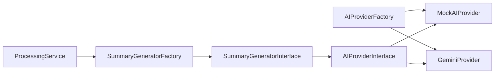

# ADR-0002: AI Provider Abstraction (Worker)

# Status

Accepted

# Context

The worker generates learning artifacts (summaries, quizzes, flashcards) using AI. Vendor APIs differ (Gemini today; OpenAI, Anthropic, local models tomorrow). Hard-coding a provider inside generators would:

- Block local development without API keys.
- Make tests depend on network calls.
- Force wide refactors when switching or combining providers.

# Decision

Introduce an **AI Provider abstraction** in the worker with Factory and Mock implementations.

```text
ProcessingService
      ↓
SummaryGeneratorInterface / ArtifactGeneratorInterface
      ↓
AISummaryGenerator (and other generators)
      ↓
AIProviderInterface
      ↓
MockAIProvider (default) | GeminiProvider
```



**Implementation details:**

| Component | Location | Responsibility |
| --------- | -------- | -------------- |
| `AIProviderInterface` | `worker/app/ai/` | `generate(prompt) → AIProviderResponse` |
| `AIProviderFactory` | `worker/app/ai/` | Select provider from env (`AI_PROVIDER`, `GEMINI_API_KEY`) |
| `MockAIProvider` | `worker/app/ai/` | Deterministic responses for dev and CI |
| `GeminiProvider` | `worker/app/ai/` | Production Gemini integration |
| `SummaryGeneratorFactory` | `worker/app/generators/` | Wire generator to configured provider |

**Default behaviour:** Mock provider when no real credentials are configured — enables full pipeline testing without external AI cost.

# Alternatives considered

## Direct Gemini SDK calls inside ProcessingService

**Rejected:** couples orchestration to one vendor; no test doubles.

## Shared AI module in backend (Symfony)

**Rejected:** processing is async and CPU/IO bound in the worker; backend stays request/response focused.

## Single monolithic `OpenAIClient` utility

**Rejected:** does not model provider selection, execution modes, or structured error types (`AIProviderHttpError`, `UnsupportedAIProviderError`).

# Consequences

## Positive

- 114 worker tests run without live AI (pytest + MockAIProvider).
- Gemini smoke test exists as optional CLI validation (`gemini_smoke_test.py`).
- New providers implement one interface + factory registration.
- Generators stay focused on prompt construction and output parsing.

## Negative

- Factory configuration must stay in sync with deployment env vars.
- Provider-specific quirks (rate limits, token caps) still need per-adapter handling.
- Two factories (`AIProviderFactory`, `SummaryGeneratorFactory`) add indirection for new contributors.

# References

- `worker/app/ai/AIProviderInterface.py`
- `worker/app/ai/AIProviderFactory.py`
- `worker/tests/test_mock_ai_provider.py`
- `worker/tests/test_gemini_provider.py`
