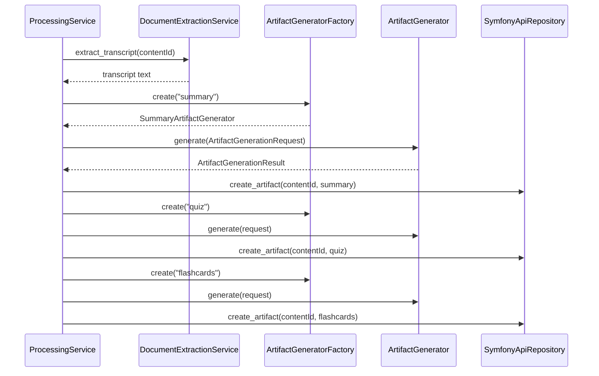

# ADR-0003: Extensible Artifact Generation Pipeline

# Status

Accepted

# Context

RFC-0001 defines a content processing pipeline: upload → extract transcript → generate multiple learning artifacts. Sprint 6–8 added quiz and flashcards alongside summary.

Each artifact type shares common steps (input validation, AI call, result shape, POST to backend) but differs in prompt and parsing. Copy-pasting generation logic in `ProcessingService` would not scale to Timeline, Mind Map, or Podcast artifacts planned for later sprints.

# Decision

Model artifact generation as a **pluggable pipeline** using the Factory and Strategy patterns.

```text
ProcessingService
      ↓
DocumentExtractionService  →  transcript
      ↓
ArtifactGeneratorFactory.create(type)
      ↓
ArtifactGeneratorInterface
      ├── SummaryArtifactGenerator
      ├── QuizArtifactGenerator
      └── FlashcardsArtifactGenerator
      ↓
SymfonyApiRepository.create_artifact()
```



**Contract:**

```python
class ArtifactGeneratorInterface:
    def generate(self, request: ArtifactGenerationRequest) -> ArtifactGenerationResult: ...
```

`ArtifactGenerationRequest` carries transcript text and metadata; generators remain stateless.

**Backend mirror:** artifacts are persisted as domain entities with type discrimination; the frontend uses `ArtifactRendererRegistry` to map types to React renderers (Registry pattern).

# Alternatives considered

## Hard-coded methods in ProcessingService (`_generate_summary`, `_generate_quiz`, …)

**Rejected:** every new artifact requires editing the orchestrator; no uniform error or request model.

## One mega-prompt returning all artifact types

**Rejected:** harder to test, retry, and version independently; poor fit for incremental UI (show summary before quiz completes).

## Worker writes directly to PostgreSQL

**Rejected:** violates backend as system of record; bypasses domain validation and API evolution.

# Consequences

## Positive

- Adding Timeline or Mind Map = new generator class + factory registration + backend artifact type + frontend renderer.
- Each generator is independently unit-tested (`test_quiz_artifact_generator.py`, etc.).
- Processing progress steps remain stable while artifact set grows.
- Aligns worker output with backend `Artifact` aggregate and REST API.

## Negative

- Orchestration order is sequential in `ProcessingService.execute()` — total job time grows with artifact count.
- Transcript is passed repeatedly; large documents may need chunking strategy later.
- Factory must guard unknown artifact types (`ArtifactGeneratorConfigurationError`).

# References

- `docs/06_RFC/RFC-0001-content-processing-pipeline.md`
- `worker/app/generators/ArtifactGeneratorFactory.py`
- `worker/app/services/ProcessingService.py`
- `frontend/src/features/processing/artifactRenderers/ArtifactRendererRegistry.tsx`
