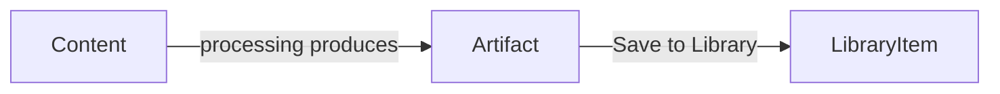

# ADR-0004: Library as a Separate Bounded Context

# Status

Accepted

# Context

Users need a durable place to save generated artifacts for later study. Artifacts belong to a **Content** processing lifecycle (draft → processing → ready). The library represents **curated personal knowledge** — a different concern from raw artifact storage.

Options included treating library entries as artifacts with a flag, or embedding library state inside the Content aggregate.

# Decision

Introduce **LibraryItem** as its own bounded context, separate from **Artifact**.

```text
Content
  └── Artifact (immutable output of processing)
        └── LibraryItem (user action: "Save to Library")
```



**Domain rules:**

| Concept | Responsibility |
| ------- | -------------- |
| `Artifact` | Stores generated payload tied to `contentId`; lifecycle follows processing |
| `LibraryItem` | References `contentId`, `artifactId`, display `title`, and `type`; created only by explicit save action |
| Save use case | Application handler validates artifact exists, creates `LibraryItem` |

**Backend stack (same pattern as other contexts):**

- Domain: `App\Domain\Library\LibraryItem`
- Port: `LibraryItemRepositoryInterface`
- Application: save/list handlers
- Presentation: `GET /api/library/items`, save endpoint

**Frontend stack:**

- `LibraryService` → `LibraryRepository` (Http / Mock)
- Features: `Library`, `LibraryItemDetails`, artifact rendering via registry

Library UI loads items through `libraryService.listItems()` — never direct HTTP in components.

# Alternatives considered

## `isSaved` flag on Artifact

**Rejected:** mixes processing state with user curation; complicates artifact immutability and listing queries.

## LibraryItem stores full artifact JSON (denormalized copy)

**Rejected for MVP:** duplicates data; current design references artifact by ID and loads content on detail page via `artifactService.listByContentId()`.

## Library as a frontend-only concept (localStorage)

**Rejected:** no cross-device persistence; inconsistent with backend-as-source-of-truth architecture.

# Consequences

## Positive

- Clear user intent: saving is an explicit domain event, not a side effect of processing.
- Library can evolve (tags, favorites, collections) without changing artifact schema.
- Frontend library feature is testable with mock repository (Vitest, no backend).
- Detail page composes library metadata + artifact renderers cleanly.

## Negative

- Detail view requires two service calls (library item + artifacts) until a dedicated GET-by-id API exists.
- Orphan prevention (deleting content/artifact while library references exist) needs future policy.
- Type field duplicated between artifact and library item for display convenience.

# References

- `backend/src/Domain/Library/`
- `frontend/src/services/library/`
- `frontend/src/features/library/`
- `frontend/src/features/processing/SaveToLibrary/`
