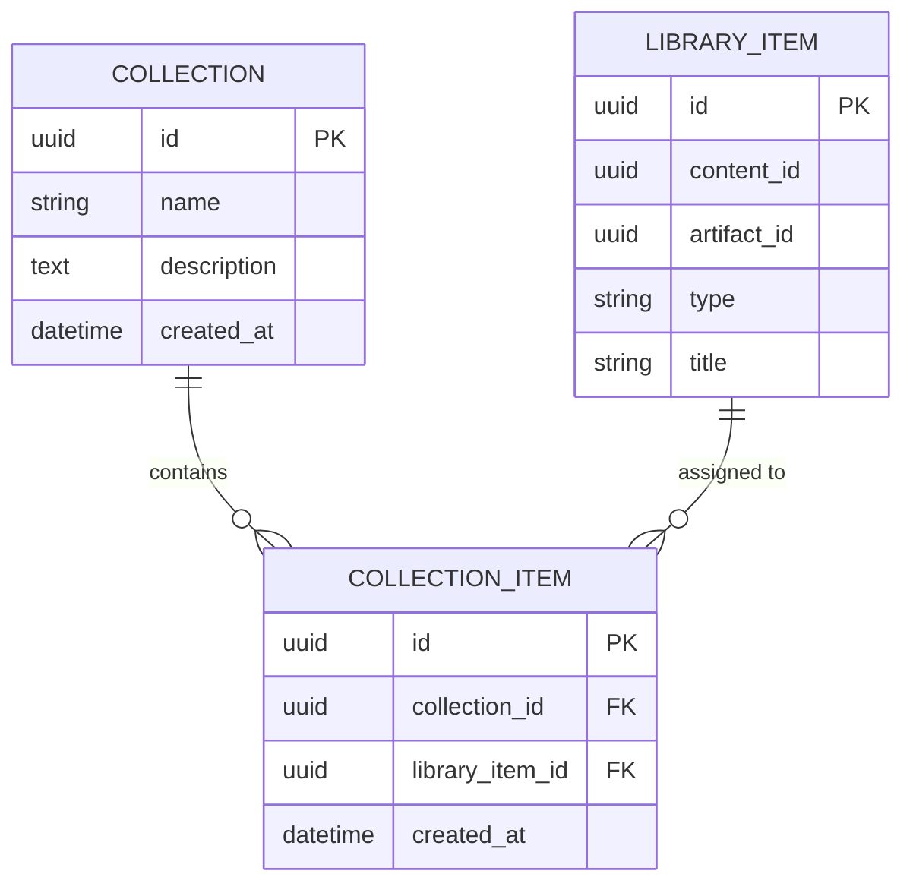

# ADR-0005: Collections via Junction Aggregate

# Status

Accepted

# Context

Sprint 10 adds **Collections** — themed groups of library items (e.g. "Ancient Rome", "Exam prep"). A library item may belong to multiple collections; a collection holds many items.

Design choices:

1. Add `collectionId` (or array) on `LibraryItem`.
2. Embed items inside `Collection` aggregate as a collection.
3. Introduce a **junction aggregate** `CollectionItem` linking `Collection` and `LibraryItem`.

# Decision

Use a **separate `CollectionItem` aggregate** and `collection_items` table with a unique constraint on `(collection_id, library_item_id)`.

```text
Collection          LibraryItem
     \               /
      \             /
    CollectionItem (junction)
```



**Key implementation choices:**

| Choice | Rationale |
| ------ | --------- |
| Do not modify `LibraryItem` or `Collection` aggregates for membership | Keeps aggregates small; assignment is its own use case |
| `CollectionItem` as first-class aggregate | Supports `createdAt`, future metadata (sort order, notes) |
| `UNIQUE(collection_id, library_item_id)` | Database-enforced duplicate prevention → HTTP 409 |
| Assign command: `AssignLibraryItemToCollectionCommand` | CQRS handler checks existence, creates junction |

**REST API (Sprint 10):**

| Method | Path | Result |
| ------ | ---- | ------ |
| `POST` | `/api/collections` | 201 — create collection |
| `GET` | `/api/collections` | 200 — list collections |
| `POST` | `/api/collections/{id}/items` | 201 assign / 409 duplicate |

**Frontend (Sprint 10):**

- `CollectionService` with `listCollections`, `createCollection`, `assignLibraryItem`
- `CollectionsPage` + `AssignToCollectionDialog` wired from Library cards ("Add to Collection")
- No `fetch()` in feature components; duplicate detected via `ApiError(409)` or `CollectionAssignmentConflictError` (mock)

# Alternatives considered

## `collectionId` column on `LibraryItem`

**Rejected:** only supports single collection per item; violates many-to-many requirement.

## JSON array of item IDs on `Collection` row

**Rejected:** poor query performance, no referential integrity, hard to enforce uniqueness across collections.

## Domain method `Collection.addItem()` mutating in-memory list

**Rejected for Sprint 10:** would bloat `Collection` aggregate and load all items on every fetch; junction table scales better.

# Consequences

## Positive

- Many-to-many model is normalized and query-friendly.
- Duplicate assignment fails fast at DB and API layer (409).
- Library and Collection contexts stay independent; optional relationship.
- Same vertical slice pattern as Library: Domain → Handler → API → `CollectionService` → UI.
- Frontend item count on collection cards deferred (`Items: -`) until list/count API exists — no fake data.

## Negative

- Listing items in a collection requires join query (not yet exposed in Sprint 10 UI).
- Extra aggregate and migration (`collection_items`) for a concept that could feel simple to users.
- Assign flow requires knowing `libraryItemId` UUID — UI must pass ID from library context.

# References

- `backend/src/Domain/CollectionItem/CollectionItem.php`
- `backend/src/Application/Collection/Handlers/AssignLibraryItemToCollectionHandler.php`
- `backend/src/Presentation/Http/Controller/Collection/`
- `frontend/src/services/collection/`
- `frontend/src/features/collection/`
- `frontend/src/features/library/LibraryContentCard.tsx` — "Add to Collection" entry point

# Verification (Sprint 10 RC)

API smoke (inside Docker):

- `POST /api/collections` → **201**
- `GET /api/collections` → **200**
- `POST /api/collections/{id}/items` → **201**
- Duplicate assign → **409** `{ "error": "Library item already assigned to collection" }`

Note: `POST /api/collections` from the Windows host may return **404** if the local backend image is stale; rebuild with `docker compose build backend`.
