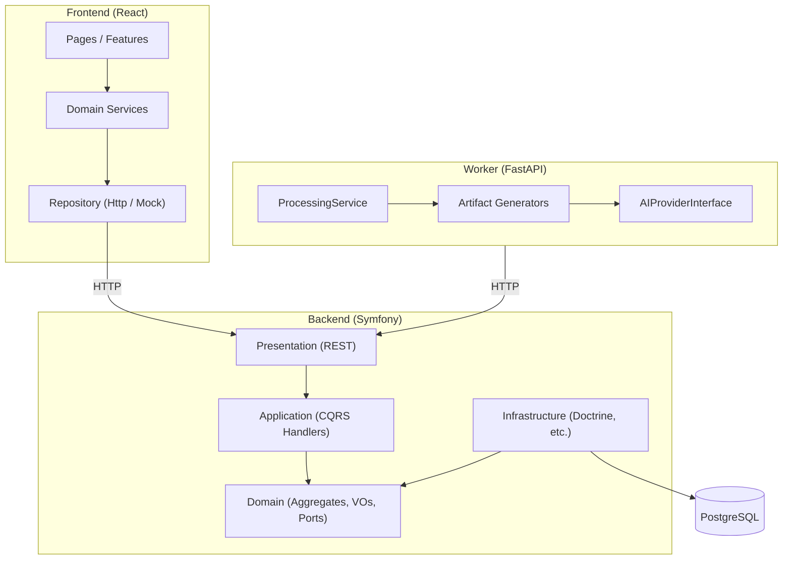

# Architecture Documentation

Version: 1.0

Status: Active

---

# Purpose

This folder records **Architecture Decision Records (ADRs)** for History AI — the major structural choices made during Sprints 1–10.

ADRs complement:

| Artifact | Location | Role |
| -------- | -------- | ---- |
| RFC | `docs/06_RFC/` | Proposal and debate before a decision |
| ADR | `docs/architecture/` (here) | Frozen record of what was decided and why |
| Blueprint | `docs/02_ARCHITECTURE/SYSTEM_BLUEPRINT.md` | How the system is organized in code |
| Engineering principles | `engineering/00_ENGINEERING_PRINCIPLES.md` | Immutable rules |

See also `docs/05_DECISIONS/README.md` for the formal RFC → ADR workflow.

---

# What is an ADR?

An ADR captures a **single architectural decision** at a point in time:

1. **Context** — the problem or constraint.
2. **Decision** — what we chose.
3. **Alternatives considered** — what we rejected.
4. **Consequences** — trade-offs (positive and negative).

ADRs are **immutable once accepted**. If a decision changes, add a new ADR that supersedes the old one.

---

# Numbering convention

```text
ADR-NNNN-short-title.md
```

| Part | Rule |
| ---- | ---- |
| `NNNN` | Four-digit zero-padded sequence (`0001`, `0002`, …) |
| `short-title` | Lowercase kebab-case summary |
| Status | `Accepted`, `Proposed`, or `Superseded by ADR-XXXX` |

When adding a new ADR:

1. Read existing ADRs to avoid duplication.
2. Use the next available number.
3. Set status to `Proposed` during review, then `Accepted`.
4. Link related RFCs and blueprint sections.
5. Update the index table below.

---

# Index

| ADR | Title | Status |
| --- | ----- | ------ |
| [ADR-0001](ADR-0001-clean-architecture.md) | Clean Architecture (backend layers) | Accepted |
| [ADR-0002](ADR-0002-ai-provider.md) | AI Provider abstraction (worker) | Accepted |
| [ADR-0003](ADR-0003-artifact-pipeline.md) | Extensible artifact generation pipeline | Accepted |
| [ADR-0004](ADR-0004-library-domain.md) | Library as a separate bounded context | Accepted |
| [ADR-0005](ADR-0005-collections.md) | Collections via junction aggregate | Accepted |

See [architecture-rules.md](./architecture-rules.md) for automated dependency enforcement.

See [ci.md](./ci.md) for the GitHub Actions pipeline.

See [openapi.md](./openapi.md) for OpenAPI / Swagger UI documentation (includes `GET /api/timeline/{artifactId}` since Sprint 14, `GET /api/maps/timeline/{artifactId}` since Sprint 15, `GET /api/contents/{contentId}/relations` since Sprint 16, and `GET /api/contents/{contentId}/graph` since Sprint 17).

---

# Sprint 14 — Interactive Timeline (2026-06)

Sprint 14 extended the Sprint 13 timeline artifact with:

| Layer | Addition |
| ----- | -------- |
| Domain | `Timeline`, `TimelineSection`, `TimelineEvent` + `TimelineParser` |
| Backend API | `GET /api/timeline/{artifactId}` → structured JSON projection |
| Frontend | `TimelineService`, `InteractiveTimeline`, markdown fallback |
| OpenAPI | `Timeline`, `TimelineSection`, `TimelineEvent` schemas |
| Architecture | Timeline layer rules (backend + frontend transport guards) |

Verification: [Sprint14-Verification.md](../reports/Sprint14-Verification.md)

---

# Sprint 15 — Interactive Historical Map (2026-06)

Sprint 15 extended the Sprint 14 timeline with geographic place resolution:

| Layer | Addition |
| ----- | -------- |
| Domain | `HistoricalPlace`, `Coordinates`, `HistoricalPlaceCollection`, `TimelinePlaceResolver` |
| Backend API | `GET /api/maps/timeline/{artifactId}` → map JSON projection |
| Frontend | `MapService`, `TimelineMapPanel`, `InteractiveMap` (CSS-only map layout) |
| OpenAPI | `Map`, `HistoricalPlace`, `Coordinates` schemas |
| Architecture | Map layer rules (backend + frontend transport guards) |

Verification: [Sprint15-Verification.md](../reports/Sprint15-Verification.md)

---

# Sprint 16 — Artifact Relations (2026-06)

Sprint 16 connected learning artifacts within a content into a deterministic relation graph:

| Layer | Addition |
| ----- | -------- |
| Domain | `ArtifactRelation`, `ArtifactRelationCollection`, `ArtifactRelationType`, `ArtifactRelationResolver` |
| Backend API | `GET /api/contents/{contentId}/relations` → relations JSON projection |
| Frontend | `RelationService`, `ArtifactRelationsPanel` on Processing page |
| OpenAPI | `ArtifactRelation`, `ArtifactRelations`, `ArtifactRelationType` schemas |
| Architecture | Relation layer rules (backend + frontend transport guards) |

Verification: [Sprint16-Verification.md](../reports/Sprint16-Verification.md)

---

# Sprint 17 — Knowledge Graph (2026-06)

Sprint 17 projected artifact relations into a navigable knowledge graph:

| Layer | Addition |
| ----- | -------- |
| Domain | `GraphNode`, `GraphEdge`, `KnowledgeGraph`, `KnowledgeGraphBuilder` |
| Backend API | `GET /api/contents/{contentId}/graph` → knowledge graph JSON projection |
| Frontend | `GraphService`, `KnowledgeGraphPanel`, `InteractiveGraph` (CSS-only layout) |
| OpenAPI | `KnowledgeGraph`, `GraphNode`, `GraphEdge` schemas |
| Architecture | Graph layer rules (backend + frontend transport guards) |

Verification: [Sprint17-Verification.md](../reports/Sprint17-Verification.md)

---

# Sprint 18 — Contextual Recommendations (2026-06)

Sprint 18 delivered contextual “See also” recommendations powered by the knowledge graph:

| Layer | Addition |
| ----- | -------- |
| Domain | `RecommendationEngine`, `RecommendedArtifact`, `RecommendedArtifactCollection`, `RecommendationReason` |
| Backend API | `GET /api/contents/{contentId}/artifacts/{artifactId}/recommendations` → recommendations JSON projection |
| Frontend | `RecommendationService`, `SeeAlsoRecommendationsPanel` under each artifact card |
| OpenAPI | `RecommendedArtifact`, `ArtifactRecommendations`, `RecommendationReason` schemas |
| Architecture | Recommendation layer rules (backend + frontend transport guards) |

Verification: [Sprint18-Verification.md](../reports/Sprint18-Verification.md)

---

# Sprint 19 — Recommendation Scoring (2026-06)

Sprint 19 enriched contextual recommendations with relevance scoring end-to-end:

| Layer | Addition |
| ----- | -------- |
| Domain | `RecommendationScoringEngine`, `RecommendationScore`, `RecommendationWeight`, `ScoredRecommendation`, `ScoredRecommendationCollection` |
| Backend API | `score` field on each recommendation in `GET /api/contents/{contentId}/artifacts/{artifactId}/recommendations` (sorted by score descending) |
| Frontend | Score mapping in `RecommendationService` layer; relevance badge in `SeeAlsoRecommendationsPanel` (`"80% relevant"`) |
| OpenAPI | `score` on `RecommendedArtifact` schema (integer 0–100) |
| Architecture | Existing recommendation layer rules unchanged |

Verification: [Sprint19-Verification.md](../reports/Sprint19-Verification.md)

---

# Sprint 20 — Semantic Search (2026-06)

Sprint 20 delivered semantic chunk retrieval end-to-end: chunking domain, embedding abstraction, deterministic embeddings, in-memory retriever, semantic search API, frontend service, and UI panel. Slice 8 changed **documentation and OpenAPI only** — no business logic in backend, frontend, or worker.

| Layer | Addition |
| ----- | -------- |
| Domain | `Chunker`, `Chunk`, `EmbeddingVector`, `EmbeddedChunk`, `EmbeddingGeneratorInterface`, `SemanticRetriever`, `SemanticQuery`, `SimilarityScore`, `RetrievedChunk` |
| Infrastructure | `DeterministicEmbeddingGenerator` (hash-based, dim 8) |
| Backend API | `GET /api/contents/{contentId}/semantic-search?q=…` → semantic search JSON projection |
| Frontend | `SemanticSearchService`, `SemanticSearchPanel`, `SemanticSearchResults` |
| OpenAPI | `RetrievedChunk`, `SemanticSearchResult` schemas |
| Architecture | Semantic layer rules (backend + frontend transport guards) |

Verification: [Sprint20-Verification.md](../reports/Sprint20-Verification.md)

---

# Sprint 21 — Vector Store (2026-06)

Sprint 21 introduced a **Vector Store abstraction** and refactored semantic retrieval to route through it. Slice 4 changed **documentation and verification only** — no business logic in backend, frontend, or worker.

| Layer | Addition |
| ----- | -------- |
| Domain | `VectorDocument`, `VectorDocumentCollection`, `VectorSearchResult`, `VectorSearchResultCollection`, `VectorStoreInterface` |
| Infrastructure | `InMemoryVectorStore` (cosine similarity, top-K, replace-on-index) |
| Application | `SearchSemanticChunksHandler` indexes `VectorDocumentCollection` before retrieval |
| Domain (refactor) | `SemanticRetriever` delegates search to `VectorStoreInterface`; cosine logic removed from retriever |
| API / Frontend / Worker | Unchanged — semantic-search contract and UI preserved |

Verification: [Sprint21-Verification.md](../reports/Sprint21-Verification.md)

---

# Sprint 22 — Real Embedding Provider (2026-06)

Sprint 22 introduced a **multi-provider embedding architecture** with config-driven selection and an optional Gemini adapter. Slice 5 changed **documentation and verification only** — no business logic in backend, frontend, or worker.

| Layer | Addition |
| ----- | -------- |
| Domain | `EmbeddingProviderInterface` — port for single-text embedding generation |
| Infrastructure | `DeterministicEmbeddingProvider` (SHA-256); `GeminiEmbeddingProvider` (Gemini `embedContent`); `EmbeddingProviderFactory`; `GeminiEmbeddingTransportInterface` |
| Refactor | `DeterministicEmbeddingGenerator` delegates to `EmbeddingProviderInterface` |
| Console | `semantic:embedding:smoke-test` — manual Gemini verification (not CI) |
| API / Frontend / Worker | Unchanged — semantic-search contract preserved |

Provider selection via `EMBEDDING_PROVIDER` env var (`deterministic` default, `gemini` requires `GEMINI_API_KEY`). Test/CI env keeps `EMBEDDING_PROVIDER=deterministic`.

Verification: [Sprint22-Verification.md](../reports/Sprint22-Verification.md)

---

# UX-01 — Chat RAG (2026-06)

UX-01 delivers an interactive RAG chat experience: backend retrieval + provider abstraction, frontend `ChatPanel`, and OpenAPI documentation for `POST /api/contents/{contentId}/chat`.

| Slice | Deliverable | Status |
| ----- | ----------- | ------ |
| UX-01-SLICE-01 | Domain chat model (`ChatOrchestrator`, `ChatProviderInterface`) | ✅ |
| UX-01-SLICE-02 | Mock RAG chat API (`POST /api/contents/{contentId}/chat`) | ✅ |
| UX-01-SLICE-03 | Generalized `ChatRequest` / `ChatResponse` provider contract | ✅ |
| UX-01-SLICE-04 | Optional `GeminiChatProvider` adapter | ✅ |
| UX-01-SLICE-05 | `ChatProviderFactory`; `CHAT_PROVIDER` env selection | ✅ |
| UX-01-SLICE-06 | Frontend `ChatService` + repository layer | ✅ |
| UX-01-SLICE-07 | Frontend `ChatPanel` UI in `ProcessingArtifacts` | ✅ |
| UX-01-SLICE-08 | OpenAPI schemas + UX-01 verification report | ✅ |

| Layer | Addition |
| ----- | -------- |
| Domain | `ChatProviderInterface` with `ChatRequest` / `ChatResponse`; `ChatProviderOptions` (temperature, maxTokens, model) |
| Infrastructure | `MockChatProvider` (default); `GeminiChatProvider`; `ChatProviderFactory`; `GeminiChatTransportInterface`; `CurlGeminiChatTransport` |
| Application | `AskContentChatHandler` builds `ChatRequest`, maps `ChatResponse` to DTO |
| Presentation | OpenAPI schemas `ChatRequest`, `ChatAnswer`, `ChatSource`; `#[OA\Post]` on chat controller |
| Frontend | `ChatService`; `ChatPanel` + props-only subcomponents; architecture guard `feature-chat-transport` |

Chat provider selection via `CHAT_PROVIDER` env var (`mock` default, `gemini` requires `GEMINI_API_KEY`). Test/CI env keeps `CHAT_PROVIDER=mock`. Gemini env vars: `GEMINI_API_KEY`, `GEMINI_CHAT_MODEL` (default `gemini-2.5-flash`). Tests use mocked transport; no live API calls in CI.

Verification: [UX01-Verification.md](../reports/UX01-Verification.md)

---

# UX-02 — Interactive Citations (2026-06)

UX-02 adds **numbered, navigable citations** to the RAG chat experience: domain `ChatCitation` model, API `citations[]` field, frontend mapping, and click-to-scroll highlight in `ProcessingArtifacts`.

| Slice | Deliverable | Status |
| ----- | ----------- | ------ |
| UX-02-SLICE-01 | Domain `ChatCitation`, `ChatCitationCollection`; `ChatResponse` enriched | ✅ |
| UX-02-SLICE-02 | Application DTO + JSON `citations[]` on chat API | ✅ |
| UX-02-SLICE-03 | Frontend citation mapping (`ChatService` layer) | ✅ |
| UX-02-SLICE-04 | Interactive navigation (`[1]` click → scroll + highlight) | ✅ |
| UX-02-SLICE-05 | OpenAPI `ChatCitation` schema + UX-02 verification report | ✅ |

| Layer | Addition |
| ----- | -------- |
| Domain | `ChatCitation`, `ChatCitationCollection`; mock provider emits `[1]` markers |
| Application | `ChatCitationResult`; `ChatAnswerResult.citations[]` |
| Presentation | OpenAPI schemas `ChatCitation`; `ChatAnswer.citations[]` |
| Frontend | `ChatCitation` type; clickable markers in `ChatMessage`; `citationNavigation.ts` |

Citations omit `text` in JSON — frontend resolves `citation.chunkId` against `sources[]` for excerpt text.

Verification: [UX02-Verification.md](../reports/UX02-Verification.md)

---

# UX-03 — Streaming Chat (2026-06)

UX-03 adds **progressive streaming answers** to the RAG chat experience: domain stream model, provider interface, mock SSE endpoint, frontend SSE service, and progressive UI in `ChatPanel`.

| Slice | Deliverable | Status |
| ----- | ----------- | ------ |
| UX-03-SLICE-01 | Domain `ChatToken`, `ChatStream`, `ChatStreamEvent`, collections | ✅ |
| UX-03-SLICE-02 | `StreamingChatProviderInterface`; `MockChatProvider` streamable | ✅ |
| UX-03-SLICE-03 | Mock SSE endpoint `POST /chat/stream` | ✅ |
| UX-03-SLICE-04 | Frontend `ChatService.streamQuestion()` + SSE parsing | ✅ |
| UX-03-SLICE-05 | Progressive assistant bubble in `ChatPanel` | ✅ |
| UX-03-SLICE-06 | OpenAPI `ChatStreamToken` + UX-03 verification report | ✅ |

| Layer | Addition |
| ----- | -------- |
| Domain | `ChatToken`, `ChatStream`, `ChatStreamEvent`; `toAnswer()` for aggregation |
| Application | `AskContentChatStreamHandler`; `ChatStreamResult` DTOs |
| Presentation | SSE `ChatStreamResponse`; OpenAPI on stream controller |
| Infrastructure | `MockChatProvider::stream()`; DI `StreamingChatProviderInterface` |
| Frontend | `HttpChatRepository.streamQuestion()` (fetch + SSE); progressive UI |

Non-streaming `POST /chat` unchanged — full answer with sources and citations.

Verification: [UX03-Verification.md](../reports/UX03-Verification.md)

---

# Platform Sprint 23 — Observability & Performance (2026-06)

Platform Sprint 23 hardened cross-cutting platform concerns: correlation IDs, performance metrics, an internal metrics API, and embedding cache. Slice 5 changed **documentation and OpenAPI only** — no business logic in backend handlers, frontend, or worker.

| Slice | Deliverable | Status |
| ----- | ----------- | ------ |
| P23-SLICE-01 | `CorrelationId`, `RequestContext`, `X-Correlation-ID` header, structured logging | ✅ |
| P23-SLICE-02 | `PerformanceTimer`, `PerformanceMetric`, RAG pipeline timings | ✅ |
| P23-SLICE-03 | `InMemoryPerformanceMetricsStore`; `GET /internal/platform/metrics` | ✅ |
| P23-SLICE-04 | `EmbeddingCacheInterface`, `CachedEmbeddingProvider` (LRU, max 1000) | ✅ |
| P23-SLICE-05 | OpenAPI `PerformanceMetric*`, architecture docs, this report | ✅ |

| Layer | Addition |
| ----- | -------- |
| Domain | `CorrelationId`; `PerformanceMetric`, `PerformanceMetricCollection`; `EmbeddingCacheKey`, `EmbeddingCacheInterface` |
| Application | `RequestContext`, `PerformanceTimer`, `PerformanceMetricsRecorderInterface`, `PerformanceMetricsReaderInterface` |
| Infrastructure | `RequestCorrelationIdListener`, `PlatformLogger`, `LoggingPerformanceMetricsRecorder`, `InMemoryPerformanceMetricsStore`, `CompositePerformanceMetricsRecorder`, `CachedEmbeddingProvider`, `InMemoryEmbeddingCache` |
| Presentation | `GET /internal/platform/metrics`; OpenAPI schemas `PerformanceMetric`, `PerformanceMetricSnapshot`, `PlatformMetricsResponse` |

Handlers instrumented: `SearchSemanticChunksHandler`, `AskContentChatHandler`, `AskContentChatStreamHandler`. Metrics captured: `chunking_ms`, `embedding_ms`, `vector_index_ms`, `retrieval_ms`, `provider_ms`, `total_ms`.

Verification: [Platform23-Verification.md](../reports/Platform23-Verification.md)

---

# Platform Sprint 24 — Conversation Memory (2026-06)

Platform Sprint 24 delivers **persistent multi-turn chat** attached to a content resource: domain model, Doctrine repository, conversation-aware API, frontend integration, and OpenAPI documentation. Slice 5 changed **documentation and OpenAPI only** — no business logic in backend handlers, frontend, or worker.

| Slice | Deliverable | Status |
| ----- | ----------- | ------ |
| P24-SLICE-01 | `ConversationId`, `Conversation`, `ConversationCollection`; immutable append | ✅ |
| P24-SLICE-02 | `ConversationRepositoryInterface`, `DoctrineConversationRepository`, migration | ✅ |
| P24-SLICE-03 | `AskConversationChatHandler`; `POST …/conversations/{conversationId}/chat` | ✅ |
| P24-SLICE-04 | Frontend `ConversationService`; `ChatPanel` uses server `conversation.messages` | ✅ |
| P24-SLICE-05 | OpenAPI `Conversation*` schemas, architecture docs, this report | ✅ |

| Layer | Addition |
| ----- | -------- |
| Domain | `ConversationId`, `Conversation`, `ChatConversation`, `ConversationRepositoryInterface` |
| Application | `AskConversationChatHandler`; `ConversationChatResult`, `ConversationResult` DTOs |
| Infrastructure | `DoctrineConversationRepository`, `ConversationRecord` (JSON messages) |
| Presentation | `AskConversationChatController`; OpenAPI schemas `Conversation`, `ConversationMessage`, `ConversationChatResponse` |
| Frontend | `ConversationService`; `ChatPanel` state from `conversation.messages`; `streamQuestion()` preserved but unused |

```text
ChatPanel → ConversationService → POST /conversations/{id}/chat
        → ConversationRepository → AskContentChatHandler (RAG) → ChatProvider
        → Conversation JSON → frontend renders conversation.messages
```

Verification: [Sprint24-Verification.md](../reports/Sprint24-Verification.md)

---

# Platform Sprint 25 — Multi-Document RAG (2026-06)

Platform Sprint 25 delivers **multi-document conversations**: domain model, Doctrine persistence, RAG across selected documents, document selection API, frontend `DocumentSelector`, and OpenAPI documentation. Slice 5 changed **documentation and OpenAPI only** — no business logic in backend handlers, frontend, or worker.

| Slice | Deliverable | Status |
| ----- | ----------- | ------ |
| P25-SLICE-01 | `SelectedDocument`, `SelectedDocumentCollection`; multi-doc `Conversation` domain | ✅ |
| P25-SLICE-02 | `documents` JSON column; `DoctrineConversationRepository` multi-doc | ✅ |
| P25-SLICE-03 | `ContentChatAnswerer`; RAG across all selected documents | ✅ |
| P25-SLICE-04A | `PUT /api/conversations/{conversationId}/documents` | ✅ |
| P25-SLICE-04B | Frontend `DocumentSelector`; `ConversationService.updateDocuments()` | ✅ |
| P25-SLICE-05 | OpenAPI multi-doc schemas, architecture docs, this report | ✅ |

| Layer | Addition |
| ----- | -------- |
| Domain | `SelectedDocument`, `SelectedDocumentCollection`; `Conversation::withDocuments()` |
| Application | `UpdateConversationDocumentsHandler`; `SelectedDocumentResult`; `documents[]` on `ConversationResult` |
| Infrastructure | `documents` JSON on `ConversationRecord`; multi-doc repository queries |
| Presentation | `UpdateConversationDocumentsController`; OpenAPI `SelectedDocument`, `UpdateConversationDocumentsRequest`, `ConversationResponse` |
| Frontend | `DocumentSelector`; `ChatPanel` document selection via `updateDocuments()` |

```text
ChatPanel → DocumentSelector → ConversationService.updateDocuments()
        → PUT /conversations/{id}/documents → conversation.documents[]
        → POST /contents/{contentId}/conversations/{id}/chat
        → RAG over all selected documents
```

Verification: [Sprint25-Verification.md](../reports/Sprint25-Verification.md)

---

# Platform Sprint 26 — Conversation Streaming (2026-06)

Platform Sprint 26 delivers **conversation-aware streaming chat**: domain stream model, SSE API with persistence, frontend `ChatPanel` integration, and OpenAPI documentation. Slice 4 changed **documentation and OpenAPI only** — no business logic in backend handlers, frontend, or worker.

| Slice | Deliverable | Status |
| ----- | ----------- | ------ |
| P26-SLICE-01 | `ConversationStream`, `ConversationStreamEvent` domain | ✅ |
| P26-SLICE-02 | `POST …/conversations/{conversationId}/chat/stream` SSE API | ✅ |
| P26-SLICE-03 | `ConversationService.streamQuestion()`; `ChatPanel` streaming UX | ✅ |
| P26-SLICE-04 | OpenAPI + architecture docs + this report | ✅ |

| Layer | Addition |
| ----- | -------- |
| Domain | `ConversationStream`, `ConversationStreamEvent`, `ConversationStreamEventCollection` |
| Application | `AskConversationChatStreamHandler`; `ContentChatStreamer`; stream DTOs |
| Presentation | `AskConversationChatStreamController`; `ConversationChatStreamResponse`; OpenAPI `ConversationStreamEvent` |
| Frontend | `ConversationService.streamQuestion()`; optimistic tokens + `conversation` event as source of truth |

```text
ChatPanel → ConversationService.streamQuestion()
        → POST /contents/{contentId}/conversations/{id}/chat/stream
        → SSE token → conversation → done
        → frontend conversation.messages = backend source of truth
```

Verification: [Sprint26-Verification.md](../reports/Sprint26-Verification.md)

---

# Platform Sprint 27 — Knowledge Graph Explorer 2.0 (2026-06)

Platform Sprint 27 extends the Sprint 17 knowledge graph with interactive neighborhood exploration and conversation-scoped graph projections. Slice 5 changed **OpenAPI documentation, architecture docs, and verification only** — no business logic in backend handlers, frontend, or worker.

| Slice | Deliverable | Status |
| ----- | ----------- | ------ |
| P27-SLICE-01 | Graph domain collections, `GraphNeighborhood`, `neighborsOf()` | ✅ |
| P27-SLICE-02 | `GET …/graph/artifacts/{artifactId}/neighborhood` | ✅ |
| P27-SLICE-03 | `GraphService.getGraphNeighborhood()`; interactive `KnowledgeGraphPanel` | ✅ |
| P27-SLICE-04 | `GET /api/conversations/{conversationId}/graph` | ✅ |
| P27-SLICE-05 | OpenAPI + architecture docs + this report | ✅ |

| Layer | Addition |
| ----- | -------- |
| Domain | `GraphNodeCollection`, `GraphEdgeCollection`, `GraphNeighborhood`, `neighborsOf()` |
| Backend API | Neighborhood endpoint; conversation-scoped graph endpoint |
| Frontend | `getGraphNeighborhood()`, `getConversationGraph()`; node highlight UX |
| OpenAPI | `GraphNeighborhood`, `GraphNeighborhoodNode`; `GraphEdge.weight` |

```text
KnowledgeGraphPanel
        │
        ▼
GraphService
        ├── GET /contents/{contentId}/graph
        ├── GET /contents/{contentId}/graph/artifacts/{artifactId}/neighborhood
        └── GET /conversations/{conversationId}/graph
        │
        ▼
InteractiveGraph (selected / neighbors / edges highlight)
```

Verification: [Sprint27-Verification.md](../reports/Sprint27-Verification.md)

---

# Platform Sprint 28 — Agent Workflows (2026-06)

Platform Sprint 28 delivers deterministic agent planning, execution trace projection, HTTP API, frontend agent mode, and OpenAPI documentation. Slice 5 changed **OpenAPI documentation, architecture docs, and verification only** — no business logic in backend handlers, frontend, or worker.

| Slice | Deliverable | Status |
| ----- | ----------- | ------ |
| P28-SLICE-01 | Agent domain (`AgentTool`, `AgentPlan`, `AgentStep`, collections) | ✅ |
| P28-SLICE-02 | `DeterministicAgentPlanner`, keyword-based plan expansion | ✅ |
| P28-SLICE-03 | `RunAgentHandler`, execution trace DTOs (no real tool calls) | ✅ |
| P28-SLICE-04 | `POST …/agent/run`; `AgentModePanel` + execution trace UI | ✅ |
| P28-SLICE-05 | OpenAPI + architecture docs + this report | ✅ |

| Layer | Addition |
| ----- | -------- |
| Domain | `AgentTool`, `AgentPlan`, `AgentStep`, `AgentExecutionResult`, status enum |
| Application | `RunAgentHandler`; plan + steps + `finalSummary` DTOs |
| Infrastructure | `DeterministicAgentPlanner` (comparison/memory keywords) |
| Backend API | `POST /api/contents/{contentId}/agent/run` |
| Frontend | `AgentService`, `AgentModePanel`, `AgentExecutionTrace` |
| OpenAPI | `AgentRunRequest`, `AgentExecution`, `AgentTool`, `AgentExecutionStatus` |

```text
AgentModePanel
        │
        ▼
AgentService.runAgent()
        │
        ▼
POST /api/contents/{contentId}/agent/run
        │
        ▼
RunAgentHandler → DeterministicAgentPlanner
        │
        ▼
AgentExecution (plan[], steps[], finalSummary)
        │
        ▼
AgentExecutionTrace UI
```

Verification: [Sprint28-Verification.md](../reports/Sprint28-Verification.md)

---

# Platform Sprint 29 — Real Tool Execution (2026-06)

Platform Sprint 29 wires **real agent tool execution** through `AgentToolExecutorInterface`. Three tools delegate to existing Application handlers; `ConversationMemory` remains a no-op stub. Slice 5 changed **OpenAPI documentation, architecture docs, and verification only** — no business logic in backend handlers, frontend, or worker.

| Slice | Deliverable | Status |
| ----- | ----------- | ------ |
| P29-SLICE-01 | `AgentToolExecution`, `AgentToolExecutionResult`, `AgentToolExecutorInterface`, `NullAgentToolExecutor` | ✅ |
| P29-SLICE-02 | `SemanticSearchToolExecutor` → `SearchSemanticChunksHandler` | ✅ |
| P29-SLICE-03 | `KnowledgeGraphToolExecutor` → `GetKnowledgeGraphHandler` | ✅ |
| P29-SLICE-04 | `MultiDocumentChatToolExecutor` → `AskConversationChatHandler` | ✅ |
| P29-SLICE-05 | OpenAPI metadata, architecture docs, this report | ✅ |

| Layer | Addition |
| ----- | -------- |
| Domain | `AgentToolExecution`, `AgentToolExecutionResult`, `AgentToolExecutorInterface`; `AgentExecutionStep.metadata` |
| Application | `RunAgentHandler` delegates each step to `AgentToolExecutorInterface`; continue-on-failure policy |
| Infrastructure | `CompositeAgentToolExecutor`, `SemanticSearchToolExecutor`, `KnowledgeGraphToolExecutor`, `MultiDocumentChatToolExecutor`, `NullAgentToolExecutor` |
| OpenAPI | `AgentExecutionStep.metadata` documented with tool-specific examples |

```text
AgentModePanel
        │
        ▼
AgentService.runAgent()
        │
        ▼
POST /api/contents/{contentId}/agent/run
        │
        ▼
RunAgentHandler → AgentPlannerInterface
        │
        ▼
CompositeAgentToolExecutor
        ├── SemanticSearchToolExecutor      ✅ real
        ├── KnowledgeGraphToolExecutor      ✅ real
        ├── MultiDocumentChatToolExecutor     ✅ real
        └── NullAgentToolExecutor           ❌ memory stub
        │
        ▼
AgentExecutionResult + step metadata
```

Verification: [Sprint29-Verification.md](../reports/Sprint29-Verification.md)

---

# Platform Sprint 30 — Agent Metadata & Conversation Memory (2026-06)

Platform Sprint 30 completes the agent tool stack: **Conversation Memory** executes against `ConversationRepositoryInterface`, **metadata aggregation** merges per-step tool metadata into `AgentExecutionResult.metadata`, and the frontend **AgentMetadataPanel** surfaces tool metrics in the agent trace UI. Slice 5 changed **OpenAPI documentation, architecture docs, and verification only** — no business logic in backend handlers, frontend, or worker.

| Slice | Deliverable | Status |
| ----- | ----------- | ------ |
| P30-SLICE-01 | `ConversationMemoryExecution`, `ConversationMemoryResult`, `ConversationMemoryToolExecutorInterface`, `NullConversationMemoryToolExecutor` | ✅ |
| P30-SLICE-02 | `ConversationMemoryToolExecutor`, composite routing | ✅ |
| P30-SLICE-03 | `AgentMetadata`, `AgentMetadataCollection`, aggregated `AgentExecutionResult.metadata` | ✅ |
| P30-SLICE-04 | HTTP `metadata` serialization; `AgentMetadataPanel` UI | ✅ |
| P30-SLICE-05 | OpenAPI top-level metadata, architecture docs, this report | ✅ |

| Layer | Addition |
| ----- | -------- |
| Domain | `ConversationMemoryExecution`, `ConversationMemoryResult`, `ConversationMemoryToolExecutorInterface`; `AgentMetadata`, `AgentMetadataCollection` |
| Application | `RunAgentHandler` aggregates step metadata; `AgentExecutionResultDto.metadata` |
| Infrastructure | `ConversationMemoryToolExecutor`, `ConversationMemoryAgentToolExecutor`; composite routes all four tools |
| Presentation | `AgentExecutionResponse` exposes `metadata` and `steps[].metadata`; OpenAPI `AgentExecution.metadata` |
| Frontend | `AgentMetadataPanel`, `agentMetadataLabels`; types map API metadata |

```text
AgentModePanel
        │
        ▼
AgentService.runAgent()
        │
        ▼
POST /api/contents/{contentId}/agent/run
        │
        ▼
RunAgentHandler → AgentPlannerInterface
        │
        ▼
CompositeAgentToolExecutor
        ├── SemanticSearchToolExecutor      ✅ real
        ├── KnowledgeGraphToolExecutor      ✅ real
        ├── ConversationMemoryToolExecutor  ✅ real
        └── MultiDocumentChatToolExecutor   ✅ real
        │
        ▼
AgentMetadataCollection.merge()
        │
        ▼
AgentExecution (plan[], steps[], finalSummary, metadata)
        │
        ▼
AgentExecutionTrace + AgentMetadataPanel
```

Verification: [Sprint30-Verification.md](../reports/Sprint30-Verification.md)

---

# Platform Sprint 31 — Video Processing Foundation (2026-06)

Platform Sprint 31 delivers the **video upload foundation** for the AI Video Localization Platform (Phase 2): domain model, multipart upload API, local storage, Doctrine persistence, queue dispatch, frontend upload UI, and OpenAPI documentation. Slice 5 changed **OpenAPI documentation, architecture docs, and verification only** — no business logic in backend handlers, frontend, or worker.

| Slice | Deliverable | Status |
| ----- | ----------- | ------ |
| P31-SLICE-01 | `VideoJob`, `VideoId`, `VideoStatus`, `VideoLanguage`, `VideoJobCollection` | ✅ |
| P31-SLICE-02 | `POST /api/videos` multipart upload endpoint | ✅ |
| P31-SLICE-03 | `LocalVideoStorage`, `DoctrineVideoRepository`, `ProcessVideoMessage` queue | ✅ |
| P31-SLICE-04 | `VideoUploadPanel`, `VideoService`, upload progress UI | ✅ |
| P31-SLICE-05 | OpenAPI video schemas, architecture docs, this report | ✅ |

| Layer | Addition |
| ----- | -------- |
| Domain | `VideoJob` aggregate, lifecycle transitions, `VideoExtension`, `VideoUploadSize` |
| Application | `UploadVideoHandler`, `VideoStorageInterface`, `VideoProcessingQueueInterface`, `ProcessVideoMessage` |
| Infrastructure | `LocalVideoStorage`, `DoctrineVideoRepository`, `MessengerVideoProcessingQueue` |
| Presentation | `UploadVideoController`, OpenAPI `UploadVideoResponse` / `VideoStatus` |
| Frontend | `VideoUploadPanel`, `VideoService`, `HttpClient.postFormData()` for progress |

```text
Frontend VideoUploadPanel
        │
        ▼
POST /api/videos (multipart, field: video)
        │
        ▼
UploadVideoHandler
        ├── validate format + size
        ├── LocalVideoStorage.store()
        ├── VideoJob.withStoragePath().queue()
        ├── DoctrineVideoRepository.save()
        └── MessengerVideoProcessingQueue.dispatch(ProcessVideoMessage)
        │
        ▼
HTTP 201 { videoId, status: "queued" }
```

Verification: [Sprint31-Verification.md](../reports/Sprint31-Verification.md)

---

# Platform Sprint 32 — Speech-to-Text Foundation (2026-06)

Platform Sprint 32 delivers the **speech-to-text foundation** for Phase 2: domain model, Faster-Whisper provider, worker integration, transcript artifact pipeline, frontend viewer, and OpenAPI documentation.

| Slice | Deliverable | Status |
| ----- | ----------- | ------ |
| P32-SLICE-01 | `Transcript`, `TranscriptSegment`, `TranscriptLanguage`, `SpeechToTextProviderInterface` | ✅ |
| P32-SLICE-02 | `FasterWhisperProvider`, `SpeechToTextProviderFactory`, output parser | ✅ |
| P32-SLICE-03 | `ProcessVideoHandler`, transcript persistence, transcript artifact | ✅ |
| P32-SLICE-04 | `TranscriptPanel`, `TranscriptTimeline`, `TranscriptService` | ✅ |
| P32-SLICE-05 | OpenAPI transcript schemas, architecture docs, verification report | ✅ |

| Layer | Addition |
| ----- | -------- |
| Domain | `Transcript` aggregate, `TranscriptSegment`, `TranscriptLanguage`, STT provider port |
| Application | `ProcessVideoHandler`, `GetVideoTranscriptHandler`, `TranscriptJsonMapper` |
| Infrastructure | `FasterWhisperProvider`, `DoctrineTranscriptRepository`, `FixedFasterWhisperProcessRunner` (test) |
| Presentation | `GetVideoTranscriptController`, OpenAPI `Transcript` / `TranscriptSegment` / `TranscriptLanguage` |
| Frontend | `TranscriptPanel`, `TranscriptTimeline`, `TranscriptService` at `/video/:videoId/transcript` |

```text
Video Upload → ProcessVideoMessage → FasterWhisperProvider
        │
        ▼
Transcript persisted + ArtifactType::Transcript
        │
        ▼
GET /api/videos/{videoId}/transcript → TranscriptPanel
```

Verification: [Sprint32-Verification.md](../reports/Sprint32-Verification.md)

---

# Platform Sprint 33 — Multilingual Translation Foundation (2026-06)

Platform Sprint 33 delivers the **multilingual translation foundation** for Phase 2: domain model, Ollama/Qwen provider, worker integration, translation artifact pipeline, frontend viewer, and OpenAPI documentation.

| Slice | Deliverable | Status |
| ----- | ----------- | ------ |
| P33-SLICE-01 | `Translation`, `TranslationSegment`, `TranslationLanguage`, `TranslationProviderInterface` | ✅ |
| P33-SLICE-02 | `OllamaTranslationProvider`, `TranslationProviderFactory`, prompt builder | ✅ |
| P33-SLICE-03 | `VideoTranslationGenerator`, translation persistence, translation artifacts, REST API | ✅ |
| P33-SLICE-04 | `TranslationPanel`, `TranslationLanguageTabs`, `TranslationService` | ✅ |
| P33-SLICE-05 | OpenAPI translation schemas, architecture docs, verification report | ✅ |

| Layer | Addition |
| ----- | -------- |
| Domain | `Translation` aggregate, `TranslationSegment`, `TranslationLanguage`, `TranslationProvider`, translation provider port |
| Application | `VideoTranslationGenerator`, `GetVideoTranslationHandler`, `ListVideoTranslationsHandler`, `GenerateVideoTranslationsHandler`, `TranslationJsonMapper` |
| Infrastructure | `OllamaTranslationProvider`, `DoctrineTranslationRepository`, `FixedOllamaClient` (test) |
| Presentation | Translation controllers, OpenAPI `Translation` / `TranslationSegment` / `TranslationLanguage` / `TranslationProvider` |
| Frontend | `TranslationPanel`, `TranslationLanguageTabs`, `TranslationService` at `/video/:videoId/translations` |

```text
Video Upload → Transcript → TranslationProviderFactory → Ollama (Qwen)
        │
        ▼
Translation persisted + ArtifactType::Translation (per language)
        │
        ▼
GET/POST /api/videos/{videoId}/translations → TranslationPanel
```

Verification: [Sprint33-Verification.md](../reports/Sprint33-Verification.md)

---

# Platform Sprint 34 — AI Engine Platform (2026-06)

Platform Sprint 34 delivers the **AI Engine Platform** abstraction layer for Phase 2: unified domain model, provider registry, capability resolution, read-only frontend settings, and OpenAPI documentation. No new user-facing video features — infrastructure only.

| Slice | Deliverable | Status |
| ----- | ----------- | ------ |
| P34-SLICE-01 | `AIEngine`, `AIEngineCapability`, `AIEngineProvider`, `AIEngineRegistry` | ✅ |
| P34-SLICE-02 | `AIEngineRegistryFactory`, `AIProviderResolver`, provider registration | ✅ |
| P34-SLICE-03 | Capability resolution in `ProcessVideoHandler`, `VideoTranslationGenerator` | ✅ |
| P34-SLICE-04 | `AIEngineSettings`, `AIProviderList`, `AIEngineService` at `/settings/ai` | ✅ |
| P34-SLICE-05 | OpenAPI AI engine schemas, architecture docs, verification report | ✅ |

| Layer | Addition |
| ----- | -------- |
| Domain | `AIEngine` aggregate, `AIEngineCapability`, `AIEngineProvider`, `AIEngineRegistry`, `AIProviderResolverInterface` |
| Application | `ListAIProvidersHandler`; handlers resolve providers by capability |
| Infrastructure | `AIEngineRegistryFactory`, `AIProviderResolver`; registers FasterWhisper, Ollama, future disabled providers |
| Presentation | `GET /api/ai/providers`, OpenAPI `AIEngine` / `AIProvider` / `AIEngineCapability` |
| Frontend | `AIEngineSettings`, `AIProviderList`, `AIEngineService` at `/settings/ai` |

```text
Application Handler
        │
        ▼
AIProviderResolverInterface (capability)
        │
        ▼
AIEngineRegistry → enabled provider
        │
        ├── SpeechToTextProvider → FasterWhisper
        ├── TranslationProvider → Ollama
        ├── TextToSpeechProvider → F5-TTS (Kokoro, XTTS disabled)
        └── (future) VoiceClone, LipSync providers
        │
        ▼
GET /api/ai/providers → AIEngineSettings (/settings/ai)
```

Verification: [Sprint34-Verification.md](../reports/Sprint34-Verification.md)

---

# Platform Sprint 35 — Text-to-Speech Foundation (2026-06)

Platform Sprint 35 delivers **translated audio generation and preview** for Phase 2: TTS domain model, F5-TTS provider integration, audio worker pipeline, frontend audio player, and OpenAPI documentation. No voice cloning, lip-sync, or video rendering.

| Slice | Deliverable | Status |
| ----- | ----------- | ------ |
| P35-SLICE-01 | `AudioArtifact`, `Voice`, `TextToSpeechProviderInterface` | ✅ |
| P35-SLICE-02 | `F5TextToSpeechProvider`, factory, AI Engine integration | ✅ |
| P35-SLICE-03 | `VideoAudioGenerator`, audio artifacts, REST endpoints | ✅ |
| P35-SLICE-04 | `AudioPlayerPanel`, `VoiceSelector`, `AudioService` | ✅ |
| P35-SLICE-05 | OpenAPI audio schemas, architecture docs, verification report | ✅ |

| Layer | Addition |
| ----- | -------- |
| Domain | `AudioArtifact`, `Voice`, `VoiceCatalog`, `TextToSpeechProvider`, `TextToSpeechProviderInterface` |
| Application | `VideoAudioGenerator`, `GenerateVideoAudioHandler`, `ListVideoAudioHandler`, `GetVideoAudioHandler` |
| Infrastructure | `F5TextToSpeechProvider`, `DoctrineAudioRepository`, `TextToSpeechProviderFactory` |
| Presentation | `GET/POST /api/videos/{videoId}/audio`, stream endpoint, OpenAPI TTS schemas |
| Frontend | `AudioPlayerPanel`, `VoiceSelector`, `AudioService` at `/video/:videoId/audio` |

```text
Translation Artifact
        │
        ▼
AIProviderResolver.resolveTextToSpeech()
        │
        ▼
F5TextToSpeechProvider
        │
        ▼
Audio Artifact (ArtifactType::Audio)
        │
        ▼
GET/POST /api/videos/{videoId}/audio → AudioPlayerPanel (/video/:videoId/audio)
```

Verification: [Sprint35-Verification.md](../reports/Sprint35-Verification.md)

---

# Platform Sprint 36 — Voice Cloning Foundation (2026-06)

Platform Sprint 36 delivers **voice cloning** for Phase 2: dedicated `VoiceClone` AI capability (separate from TTS), OpenVoice V2 provider, worker pipeline, frontend compare mode, and OpenAPI documentation. No lip-sync or video rendering.

| Slice | Deliverable | Status |
| ----- | ----------- | ------ |
| P36-SLICE-01 | `VoiceProfile`, `VoiceCloneArtifact`, `VoiceCloneProviderInterface` | ✅ |
| P36-SLICE-02 | `OpenVoiceProvider`, factory, AI Engine integration | ✅ |
| P36-SLICE-03 | `VideoVoiceCloneGenerator`, voice clone artifacts, REST endpoints | ✅ |
| P36-SLICE-04 | `VoiceClonePanel`, `VoiceModeSelector`, `VoiceCloneService` | ✅ |
| P36-SLICE-05 | OpenAPI voice clone schemas, architecture docs, verification report | ✅ |

| Layer | Addition |
| ----- | -------- |
| Domain | `VoiceProfile`, `VoiceCloneArtifact`, `VoiceCloneProvider`, `VoiceCloneProviderInterface` |
| Application | `VideoVoiceCloneGenerator`, voice clone handlers, `VoiceCloneJsonMapper` |
| Infrastructure | `OpenVoiceProvider`, `DoctrineVoiceCloneRepository`, `VoiceCloneProviderFactory` |
| Presentation | `GET/POST /api/videos/{videoId}/voice-clone`, stream endpoint, OpenAPI schemas |
| Frontend | `VoiceClonePanel`, `VoiceModeSelector`, `VoiceCloneService` at `/video/:videoId/voice-clone` |

```text
Generic Audio (F5-TTS)
        │
        ▼
AIProviderResolver.resolveVoiceClone()
        │
        ▼
OpenVoiceProvider
        │
        ▼
VoiceCloneArtifact (ArtifactType::VoiceClone)
        │
        ▼
GET/POST /api/videos/{videoId}/voice-clone → VoiceClonePanel (/video/:videoId/voice-clone)
```

Verification: [Sprint36-Verification.md](../reports/Sprint36-Verification.md)

---

# Project architecture overview

History AI is a **modular monolith** with three runtime applications and a shared domain story:



**Dependency rule (backend):** outer layers depend on inner layers. Domain depends on nothing infrastructure-specific.

**Dependency rule (frontend):** UI features call services only. HTTP is confined to `HttpClient` + repository implementations.

**Dependency rule (worker):** processing orchestration depends on generator and provider interfaces, not concrete AI vendors.

---

# Domain model (Sprint 10)

```text
Content
  └── ProcessingJob
        └── Artifact (transcript, summary, quiz, flashcards, timeline, podcast, …)
              └── LibraryItem (saved artifact reference)
                    └── CollectionItem (many-to-many via junction)
                          └── Collection
```

Each bounded context follows the same vertical slice:

Domain → Repository Port → Doctrine Adapter → Application (CQRS) → REST API → Frontend Service → UI.

---

# Related documentation

- [SYSTEM_BLUEPRINT.md](../02_ARCHITECTURE/SYSTEM_BLUEPRINT.md)
- [RFC-0001 Content Processing Pipeline](../06_RFC/RFC-0001-content-processing-pipeline.md)
- [Engineering Principles](../../engineering/00_ENGINEERING_PRINCIPLES.md)
- [Frontend Repository Pattern](../frontend/Repository%20Pattern.md)
