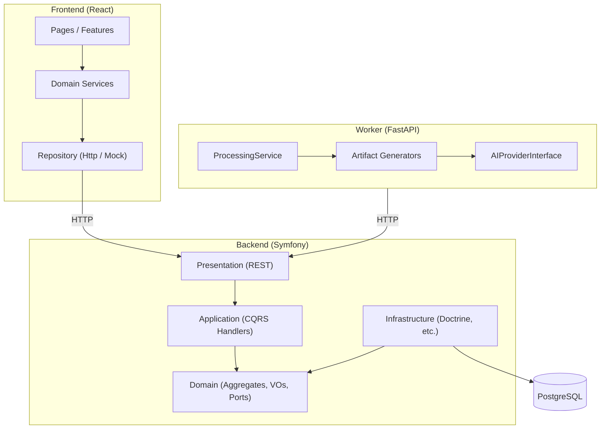

# Architecture Documentation

Version: 1.0

Status: Active

---

# Purpose

This folder records **Architecture Decision Records (ADRs)** for History AI — the major structural choices made during Sprints 1–10.

ADRs complement:

| Artifact | Location | Role |
| -------- | -------- | ---- |
| RFC | `docs/06_RFC/` | Proposal and debate before a decision |
| ADR | `docs/architecture/` (here) | Frozen record of what was decided and why |
| Blueprint | `docs/02_ARCHITECTURE/SYSTEM_BLUEPRINT.md` | How the system is organized in code |
| Engineering principles | `engineering/00_ENGINEERING_PRINCIPLES.md` | Immutable rules |

See also `docs/05_DECISIONS/README.md` for the formal RFC → ADR workflow.

---

# What is an ADR?

An ADR captures a **single architectural decision** at a point in time:

1. **Context** — the problem or constraint.
2. **Decision** — what we chose.
3. **Alternatives considered** — what we rejected.
4. **Consequences** — trade-offs (positive and negative).

ADRs are **immutable once accepted**. If a decision changes, add a new ADR that supersedes the old one.

---

# Numbering convention

```text
ADR-NNNN-short-title.md
```

| Part | Rule |
| ---- | ---- |
| `NNNN` | Four-digit zero-padded sequence (`0001`, `0002`, …) |
| `short-title` | Lowercase kebab-case summary |
| Status | `Accepted`, `Proposed`, or `Superseded by ADR-XXXX` |

When adding a new ADR:

1. Read existing ADRs to avoid duplication.
2. Use the next available number.
3. Set status to `Proposed` during review, then `Accepted`.
4. Link related RFCs and blueprint sections.
5. Update the index table below.

---

# Index

| ADR | Title | Status |
| --- | ----- | ------ |
| [ADR-0001](ADR-0001-clean-architecture.md) | Clean Architecture (backend layers) | Accepted |
| [ADR-0002](ADR-0002-ai-provider.md) | AI Provider abstraction (worker) | Accepted |
| [ADR-0003](ADR-0003-artifact-pipeline.md) | Extensible artifact generation pipeline | Accepted |
| [ADR-0004](ADR-0004-library-domain.md) | Library as a separate bounded context | Accepted |
| [ADR-0005](ADR-0005-collections.md) | Collections via junction aggregate | Accepted |

See [architecture-rules.md](./architecture-rules.md) for automated dependency enforcement.

See [ci.md](./ci.md) for the GitHub Actions pipeline.

See [openapi.md](./openapi.md) for OpenAPI / Swagger UI documentation (includes `GET /api/timeline/{artifactId}` since Sprint 14, `GET /api/maps/timeline/{artifactId}` since Sprint 15, `GET /api/contents/{contentId}/relations` since Sprint 16, and `GET /api/contents/{contentId}/graph` since Sprint 17).

---

# Sprint 14 — Interactive Timeline (2026-06)

Sprint 14 extended the Sprint 13 timeline artifact with:

| Layer | Addition |
| ----- | -------- |
| Domain | `Timeline`, `TimelineSection`, `TimelineEvent` + `TimelineParser` |
| Backend API | `GET /api/timeline/{artifactId}` → structured JSON projection |
| Frontend | `TimelineService`, `InteractiveTimeline`, markdown fallback |
| OpenAPI | `Timeline`, `TimelineSection`, `TimelineEvent` schemas |
| Architecture | Timeline layer rules (backend + frontend transport guards) |

Verification: [Sprint14-Verification.md](../reports/Sprint14-Verification.md)

---

# Sprint 15 — Interactive Historical Map (2026-06)

Sprint 15 extended the Sprint 14 timeline with geographic place resolution:

| Layer | Addition |
| ----- | -------- |
| Domain | `HistoricalPlace`, `Coordinates`, `HistoricalPlaceCollection`, `TimelinePlaceResolver` |
| Backend API | `GET /api/maps/timeline/{artifactId}` → map JSON projection |
| Frontend | `MapService`, `TimelineMapPanel`, `InteractiveMap` (CSS-only map layout) |
| OpenAPI | `Map`, `HistoricalPlace`, `Coordinates` schemas |
| Architecture | Map layer rules (backend + frontend transport guards) |

Verification: [Sprint15-Verification.md](../reports/Sprint15-Verification.md)

---

# Sprint 16 — Artifact Relations (2026-06)

Sprint 16 connected learning artifacts within a content into a deterministic relation graph:

| Layer | Addition |
| ----- | -------- |
| Domain | `ArtifactRelation`, `ArtifactRelationCollection`, `ArtifactRelationType`, `ArtifactRelationResolver` |
| Backend API | `GET /api/contents/{contentId}/relations` → relations JSON projection |
| Frontend | `RelationService`, `ArtifactRelationsPanel` on Processing page |
| OpenAPI | `ArtifactRelation`, `ArtifactRelations`, `ArtifactRelationType` schemas |
| Architecture | Relation layer rules (backend + frontend transport guards) |

Verification: [Sprint16-Verification.md](../reports/Sprint16-Verification.md)

---

# Sprint 17 — Knowledge Graph (2026-06)

Sprint 17 projected artifact relations into a navigable knowledge graph:

| Layer | Addition |
| ----- | -------- |
| Domain | `GraphNode`, `GraphEdge`, `KnowledgeGraph`, `KnowledgeGraphBuilder` |
| Backend API | `GET /api/contents/{contentId}/graph` → knowledge graph JSON projection |
| Frontend | `GraphService`, `KnowledgeGraphPanel`, `InteractiveGraph` (CSS-only layout) |
| OpenAPI | `KnowledgeGraph`, `GraphNode`, `GraphEdge` schemas |
| Architecture | Graph layer rules (backend + frontend transport guards) |

Verification: [Sprint17-Verification.md](../reports/Sprint17-Verification.md)

---

# Sprint 18 — Contextual Recommendations (2026-06)

Sprint 18 delivered contextual “See also” recommendations powered by the knowledge graph:

| Layer | Addition |
| ----- | -------- |
| Domain | `RecommendationEngine`, `RecommendedArtifact`, `RecommendedArtifactCollection`, `RecommendationReason` |
| Backend API | `GET /api/contents/{contentId}/artifacts/{artifactId}/recommendations` → recommendations JSON projection |
| Frontend | `RecommendationService`, `SeeAlsoRecommendationsPanel` under each artifact card |
| OpenAPI | `RecommendedArtifact`, `ArtifactRecommendations`, `RecommendationReason` schemas |
| Architecture | Recommendation layer rules (backend + frontend transport guards) |

Verification: [Sprint18-Verification.md](../reports/Sprint18-Verification.md)

---

# Sprint 19 — Recommendation Scoring (2026-06)

Sprint 19 enriched contextual recommendations with relevance scoring end-to-end:

| Layer | Addition |
| ----- | -------- |
| Domain | `RecommendationScoringEngine`, `RecommendationScore`, `RecommendationWeight`, `ScoredRecommendation`, `ScoredRecommendationCollection` |
| Backend API | `score` field on each recommendation in `GET /api/contents/{contentId}/artifacts/{artifactId}/recommendations` (sorted by score descending) |
| Frontend | Score mapping in `RecommendationService` layer; relevance badge in `SeeAlsoRecommendationsPanel` (`"80% relevant"`) |
| OpenAPI | `score` on `RecommendedArtifact` schema (integer 0–100) |
| Architecture | Existing recommendation layer rules unchanged |

Verification: [Sprint19-Verification.md](../reports/Sprint19-Verification.md)

---

# Sprint 20 — Semantic Search (2026-06)

Sprint 20 delivered semantic chunk retrieval end-to-end: chunking domain, embedding abstraction, deterministic embeddings, in-memory retriever, semantic search API, frontend service, and UI panel. Slice 8 changed **documentation and OpenAPI only** — no business logic in backend, frontend, or worker.

| Layer | Addition |
| ----- | -------- |
| Domain | `Chunker`, `Chunk`, `EmbeddingVector`, `EmbeddedChunk`, `EmbeddingGeneratorInterface`, `SemanticRetriever`, `SemanticQuery`, `SimilarityScore`, `RetrievedChunk` |
| Infrastructure | `DeterministicEmbeddingGenerator` (hash-based, dim 8) |
| Backend API | `GET /api/contents/{contentId}/semantic-search?q=…` → semantic search JSON projection |
| Frontend | `SemanticSearchService`, `SemanticSearchPanel`, `SemanticSearchResults` |
| OpenAPI | `RetrievedChunk`, `SemanticSearchResult` schemas |
| Architecture | Semantic layer rules (backend + frontend transport guards) |

Verification: [Sprint20-Verification.md](../reports/Sprint20-Verification.md)

---

# Sprint 21 — Vector Store (2026-06)

Sprint 21 introduced a **Vector Store abstraction** and refactored semantic retrieval to route through it. Slice 4 changed **documentation and verification only** — no business logic in backend, frontend, or worker.

| Layer | Addition |
| ----- | -------- |
| Domain | `VectorDocument`, `VectorDocumentCollection`, `VectorSearchResult`, `VectorSearchResultCollection`, `VectorStoreInterface` |
| Infrastructure | `InMemoryVectorStore` (cosine similarity, top-K, replace-on-index) |
| Application | `SearchSemanticChunksHandler` indexes `VectorDocumentCollection` before retrieval |
| Domain (refactor) | `SemanticRetriever` delegates search to `VectorStoreInterface`; cosine logic removed from retriever |
| API / Frontend / Worker | Unchanged — semantic-search contract and UI preserved |

Verification: [Sprint21-Verification.md](../reports/Sprint21-Verification.md)

---

# Sprint 22 — Real Embedding Provider (2026-06)

Sprint 22 introduced a **multi-provider embedding architecture** with config-driven selection and an optional Gemini adapter. Slice 5 changed **documentation and verification only** — no business logic in backend, frontend, or worker.

| Layer | Addition |
| ----- | -------- |
| Domain | `EmbeddingProviderInterface` — port for single-text embedding generation |
| Infrastructure | `DeterministicEmbeddingProvider` (SHA-256); `GeminiEmbeddingProvider` (Gemini `embedContent`); `EmbeddingProviderFactory`; `GeminiEmbeddingTransportInterface` |
| Refactor | `DeterministicEmbeddingGenerator` delegates to `EmbeddingProviderInterface` |
| Console | `semantic:embedding:smoke-test` — manual Gemini verification (not CI) |
| API / Frontend / Worker | Unchanged — semantic-search contract preserved |

Provider selection via `EMBEDDING_PROVIDER` env var (`deterministic` default, `gemini` requires `GEMINI_API_KEY`). Test/CI env keeps `EMBEDDING_PROVIDER=deterministic`.

Verification: [Sprint22-Verification.md](../reports/Sprint22-Verification.md)

---

# UX-01 — Chat RAG (2026-06)

UX-01 delivers a read-only chat API over the semantic retrieval pipeline. Slice 4 adds an optional Gemini chat adapter without changing the HTTP contract.

| Layer | Addition |
| ----- | -------- |
| Domain | `ChatProviderInterface` with `ChatRequest` / `ChatResponse`; `ChatProviderOptions` (temperature, maxTokens, model) |
| Infrastructure | `MockChatProvider` (default); `GeminiChatProvider`; `GeminiChatTransportInterface`; `CurlGeminiChatTransport` |
| Application | `AskContentChatHandler` builds `ChatRequest`, maps `ChatResponse` to DTO |
| API / Frontend / Worker | Unchanged — `POST /api/contents/{contentId}/chat` contract preserved |

Chat provider wiring: `MockChatProvider` remains default. `GeminiChatProvider` is registered but activation is deferred. Gemini env vars: `GEMINI_API_KEY`, `GEMINI_CHAT_MODEL` (default `gemini-2.5-flash`). Tests use mocked transport; no live API calls in CI.

---

# Project architecture overview

History AI is a **modular monolith** with three runtime applications and a shared domain story:



**Dependency rule (backend):** outer layers depend on inner layers. Domain depends on nothing infrastructure-specific.

**Dependency rule (frontend):** UI features call services only. HTTP is confined to `HttpClient` + repository implementations.

**Dependency rule (worker):** processing orchestration depends on generator and provider interfaces, not concrete AI vendors.

---

# Domain model (Sprint 10)

```text
Content
  └── ProcessingJob
        └── Artifact (transcript, summary, quiz, flashcards, timeline, podcast, …)
              └── LibraryItem (saved artifact reference)
                    └── CollectionItem (many-to-many via junction)
                          └── Collection
```

Each bounded context follows the same vertical slice:

Domain → Repository Port → Doctrine Adapter → Application (CQRS) → REST API → Frontend Service → UI.

---

# Related documentation

- [SYSTEM_BLUEPRINT.md](../02_ARCHITECTURE/SYSTEM_BLUEPRINT.md)
- [RFC-0001 Content Processing Pipeline](../06_RFC/RFC-0001-content-processing-pipeline.md)
- [Engineering Principles](../../engineering/00_ENGINEERING_PRINCIPLES.md)
- [Frontend Repository Pattern](../frontend/Repository%20Pattern.md)
