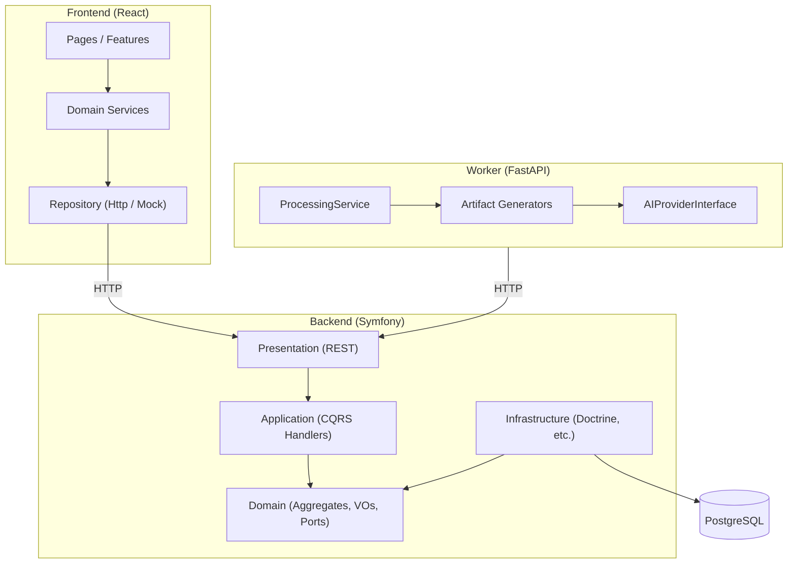

# Architecture Documentation

Version: 1.0

Status: Active

---

# Purpose

This folder records **Architecture Decision Records (ADRs)** for History AI — the major structural choices made during Sprints 1–10.

ADRs complement:

| Artifact | Location | Role |
| -------- | -------- | ---- |
| RFC | `docs/06_RFC/` | Proposal and debate before a decision |
| ADR | `docs/architecture/` (here) | Frozen record of what was decided and why |
| Blueprint | `docs/02_ARCHITECTURE/SYSTEM_BLUEPRINT.md` | How the system is organized in code |
| Engineering principles | `engineering/00_ENGINEERING_PRINCIPLES.md` | Immutable rules |

See also `docs/05_DECISIONS/README.md` for the formal RFC → ADR workflow.

---

# What is an ADR?

An ADR captures a **single architectural decision** at a point in time:

1. **Context** — the problem or constraint.
2. **Decision** — what we chose.
3. **Alternatives considered** — what we rejected.
4. **Consequences** — trade-offs (positive and negative).

ADRs are **immutable once accepted**. If a decision changes, add a new ADR that supersedes the old one.

---

# Numbering convention

```text
ADR-NNNN-short-title.md
```

| Part | Rule |
| ---- | ---- |
| `NNNN` | Four-digit zero-padded sequence (`0001`, `0002`, …) |
| `short-title` | Lowercase kebab-case summary |
| Status | `Accepted`, `Proposed`, or `Superseded by ADR-XXXX` |

When adding a new ADR:

1. Read existing ADRs to avoid duplication.
2. Use the next available number.
3. Set status to `Proposed` during review, then `Accepted`.
4. Link related RFCs and blueprint sections.
5. Update the index table below.

---

# Index

| ADR | Title | Status |
| --- | ----- | ------ |
| [ADR-0001](ADR-0001-clean-architecture.md) | Clean Architecture (backend layers) | Accepted |
| [ADR-0002](ADR-0002-ai-provider.md) | AI Provider abstraction (worker) | Accepted |
| [ADR-0003](ADR-0003-artifact-pipeline.md) | Extensible artifact generation pipeline | Accepted |
| [ADR-0004](ADR-0004-library-domain.md) | Library as a separate bounded context | Accepted |
| [ADR-0005](ADR-0005-collections.md) | Collections via junction aggregate | Accepted |

See [architecture-rules.md](./architecture-rules.md) for automated dependency enforcement.

See [ci.md](./ci.md) for the GitHub Actions pipeline.

See [openapi.md](./openapi.md) for OpenAPI / Swagger UI documentation.

---

# Project architecture overview

History AI is a **modular monolith** with three runtime applications and a shared domain story:



**Dependency rule (backend):** outer layers depend on inner layers. Domain depends on nothing infrastructure-specific.

**Dependency rule (frontend):** UI features call services only. HTTP is confined to `HttpClient` + repository implementations.

**Dependency rule (worker):** processing orchestration depends on generator and provider interfaces, not concrete AI vendors.

---

# Domain model (Sprint 10)

```text
Content
  └── ProcessingJob
        └── Artifact (summary, quiz, flashcards, transcript, …)
              └── LibraryItem (saved artifact reference)
                    └── CollectionItem (many-to-many via junction)
                          └── Collection
```

Each bounded context follows the same vertical slice:

Domain → Repository Port → Doctrine Adapter → Application (CQRS) → REST API → Frontend Service → UI.

---

# Related documentation

- [SYSTEM_BLUEPRINT.md](../02_ARCHITECTURE/SYSTEM_BLUEPRINT.md)
- [RFC-0001 Content Processing Pipeline](../06_RFC/RFC-0001-content-processing-pipeline.md)
- [Engineering Principles](../../engineering/00_ENGINEERING_PRINCIPLES.md)
- [Frontend Repository Pattern](../frontend/Repository%20Pattern.md)
