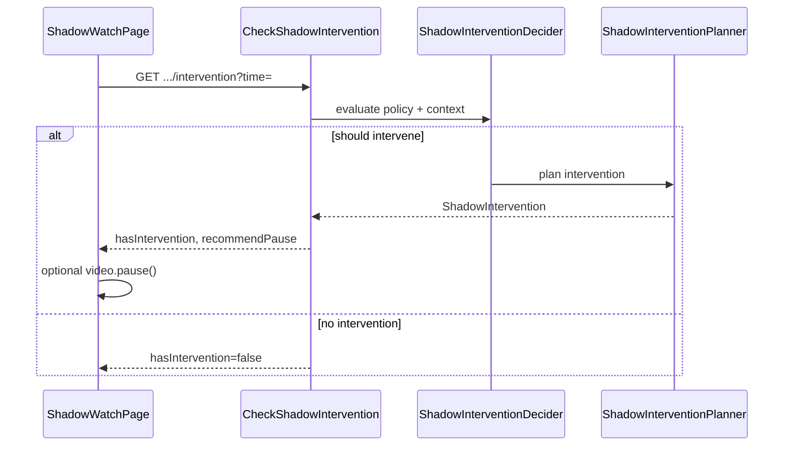

# Shadow Proactive Tutor

**Sprint:** 56  
**Product:** Lumen  
**Status:** Active

---

## Purpose

Extend the Shadow AI watch companion with an **optional proactive tutor** that can pause learning moments, ask vocabulary or concept checks, and explain difficult segments — while keeping the user in control.

Proactive mode is **off by default**. When enabled, Shadow evaluates playback context deterministically (no LLM for *when* to intervene) and returns **recommendations** only. The browser video element still controls actual playback.

---

## Bounded context extensions

| Layer | Location |
| ----- | -------- |
| Domain | `ShadowIntervention`, `ShadowInterventionPolicy`, `ShadowChallenge` |
| Application | `ShadowInterventionDecider`, `ShadowInterventionPlanner`, handlers |
| HTTP | `CheckShadowInterventionController`, `AnswerShadowInterventionController`, … |
| Frontend | `ShadowTutorSettings`, `ShadowInterventionCard`, `ShadowWatchPage` |

Core concepts:

- **ShadowInterventionPolicy** — user preferences: frequency, challenge level, auto pause/resume
- **ShadowIntervention** — planned learning moment with reason, trigger, optional challenge
- **recommendPause / recommendResume** — backend hints; frontend decides whether to pause/play

---

## Intervention decision flow

Triggers include unknown vocabulary, complex sentences, long segments, segment boundaries, and idle watching. Rate limits come from the session policy (`maxInterventionsPerMinute`, `minSecondsBetweenInterventions`).

---

## Backend command model

| Command | HTTP | Effect |
| ------- | ---- | ------ |
| Check intervention | `GET .../sessions/{sessionId}/intervention?time=` | Evaluate context; may create intervention |
| Answer intervention | `POST .../intervention/{interventionId}/answer` | LLM reply to challenge; may recommend resume |
| Skip intervention | `POST .../intervention/{interventionId}/skip` | Mark skipped; may recommend resume |
| Update policy | `PUT .../sessions/{sessionId}/policy` | Enable/disable proactive tutor settings |

Manual Shadow Q&A from Sprint 55 (`POST .../ask`) is unchanged.

---

## Frontend experience

On `/video/:videoId/watch`:

- **Proactive tutor settings** — toggle, tutor mode, challenge level, frequency, explanation style, auto pause/resume
- **Shadow tutor badge** — shows when proactive mode is on
- **Intervention card** — reason, challenge prompt, answer input, skip
- **Resume prompt** — after answer/skip when backend recommends resume
- Debounced intervention checks (900ms) while playing and policy enabled
- Localized in English, French, and German (`pipeline.shadow.*`)
- Challenge prompts and replies use backend `speechLanguage` metadata for browser TTS (Sprint 56.5)

---

## Design constraints

| Rule | Rationale |
| ---- | --------- |
| Proactive off by default | Avoid interrupting passive watching |
| Backend never controls player | Separation of concerns; browser owns `<video>` |
| Deterministic intervention timing | Predictable, testable behavior |
| Reuse transcript/translation context | No duplicate pipeline |
| Extend Shadow session aggregate | Single bounded context |

---

## Related documents

- [SHADOW_WATCH_COMPANION.md](./SHADOW_WATCH_COMPANION.md) — Sprint 55 foundation
- [openapi.md](./openapi.md) — Shadow proactive endpoints and schemas
